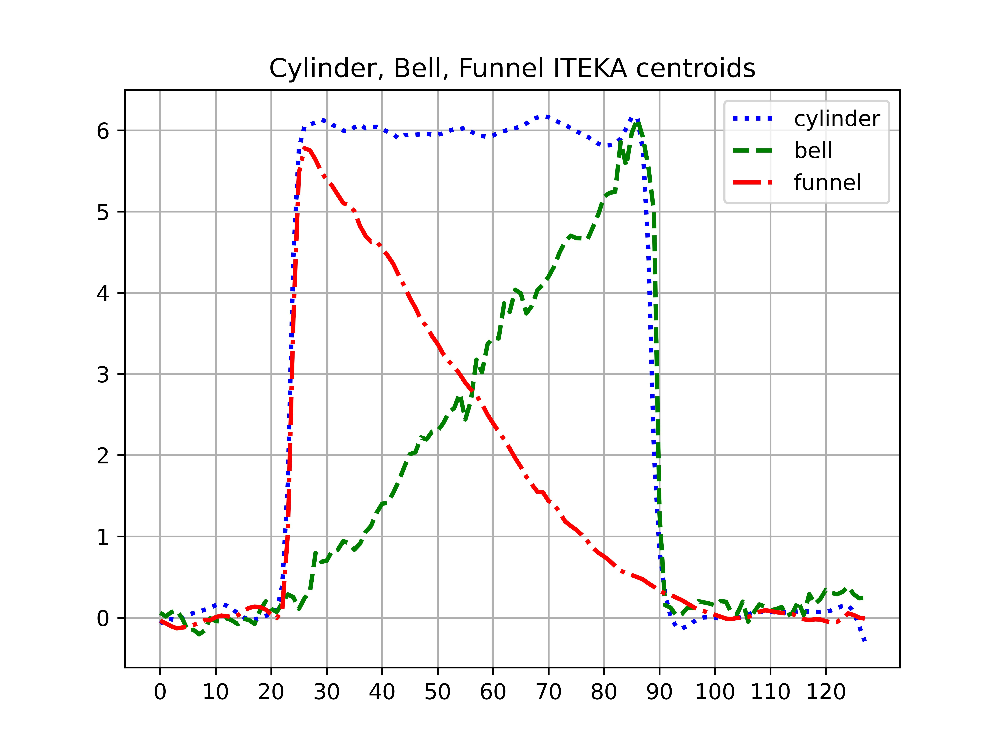
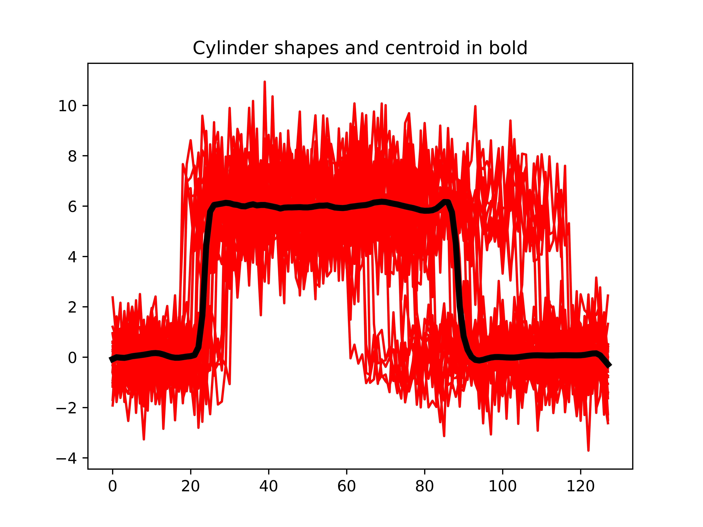
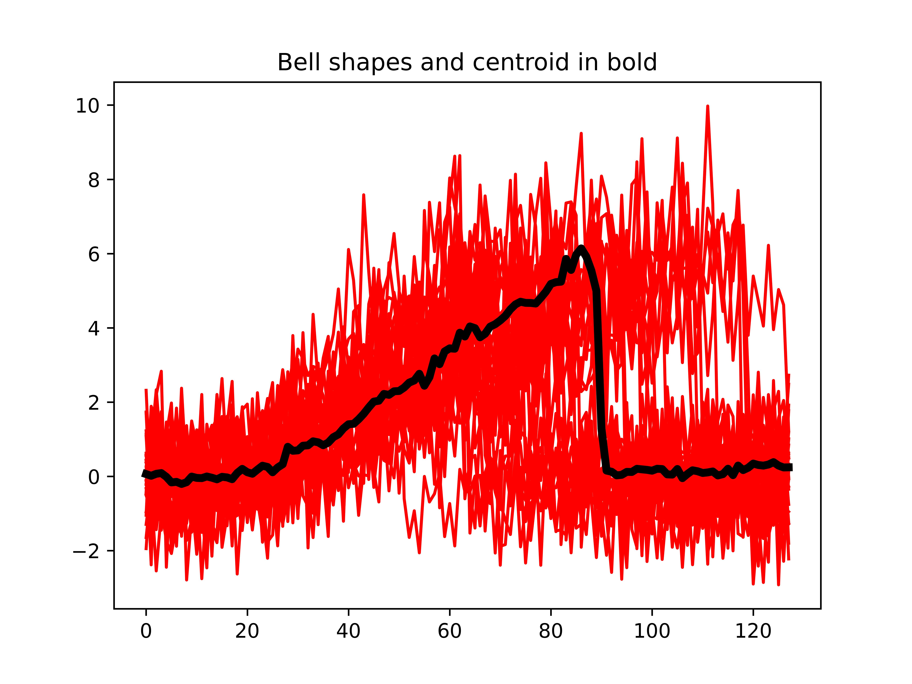
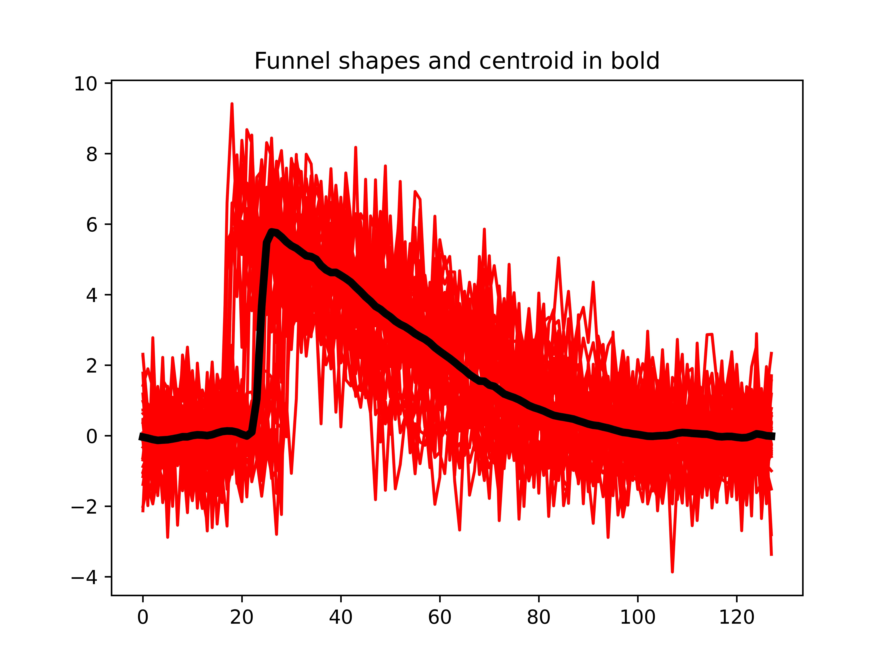

# py-TEKA : Python wrapper to module TEKA 
### Implementation of the TEKA (Time Elastic Kernel Averaging of set of time series) code defined and used in [1]. The TEKA code is written in C++ and the python wrapper is using the CYTHON compiler

## Requirements
- g++ compiler
- CYTHON compiler
- python3.*
- matplotlib

## To install
$ sh install.sh

## To uninstall 
$ sh uninstall.sh

## To test py-TEKA on the Cylinder, Bell, Funnel dataset
$ python3 testCBF.py

  
  
  
  

Please cite the following article if needed to.
[1] Marteau, P.F., Times series averaging and denoising from a probabilistic perspective on time-elastic kernels International Journal of Applied Mathematics and Computer Science, Vol 29, num 2, pp 375–392, De Gruyter editor [https://arxiv.org/abs/1611.09194 "pdf"]
